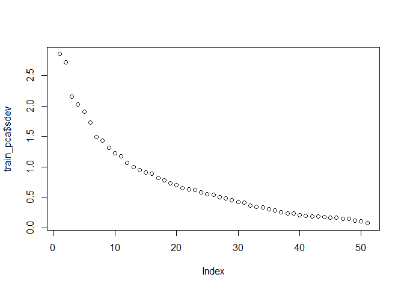

## Synopsis
The goal of this analysis is to predict the classe variable in the testing set. The classe variable  indicates the way in which the person performs the exercise. To do this task We will take into account information on accelerometers that provide us 159 variables. We use a Random Forest as model and we estimate the model error using  a cross validation with k=10.

## Loading the database 

```r
#install.packages('RCurl')
#install.packages('purrr')
#install.packages("rlang", type = "source")
#install.packages('caret',dependencies=T)
#install.packages('randomForest')
library(RCurl)
```

```
## Loading required package: bitops
```

```r
library(rlang)
library(caret)
```

```
## Loading required package: lattice
```

```
## Loading required package: ggplot2
```

```r
library(purrr)
```

```
## 
## Attaching package: 'purrr'
```

```
## The following object is masked from 'package:caret':
## 
##     lift
```

```
## The following objects are masked from 'package:rlang':
## 
##     %@%, %||%, as_function, flatten, flatten_chr, flatten_dbl,
##     flatten_int, flatten_lgl, invoke, list_along, modify, prepend,
##     rep_along, splice
```

```r
library(randomForest)
```

```
## randomForest 4.6-14
```

```
## Type rfNews() to see new features/changes/bug fixes.
```

```
## 
## Attaching package: 'randomForest'
```

```
## The following object is masked from 'package:ggplot2':
## 
##     margin
```

```r
url_test='https://d396qusza40orc.cloudfront.net/predmachlearn/pml-testing.csv'
url_train='https://d396qusza40orc.cloudfront.net/predmachlearn/pml-training.csv'
test=read.csv(textConnection(getURL(url_test)))
train=read.csv(textConnection(getURL(url_train)))
```

## Exploratory Data analysis
We have two datasets: training and testing. Training set has 19622 samples and 159 variables and classe as a response variable. In other hand, test set has 20 samples and 159 variables and we need to estimate the response variable for each sample. As we can see that the response variable has 5 levels, A, B, C, D and E and the total number of samples per level is shown below.

```r
dim(test)
```

```
## [1]  20 160
```

```r
dim(train)
```

```
## [1] 19622   160
```

```r
summary(train$classe)
```

```
##    A    B    C    D    E 
## 5580 3797 3422 3216 3607
```
First of all, we will check if the data base has missing values and white values.


```r
num_na=sapply(train, function(x) sum(is.na(x)))
num_white=sapply(train,function(x) sum(as.numeric(x=="")))
num_white[is.na(num_white)]<-1000
num_na
```

```
##                        X                user_name     raw_timestamp_part_1 
##                        0                        0                        0 
##     raw_timestamp_part_2           cvtd_timestamp               new_window 
##                        0                        0                        0 
##               num_window                roll_belt               pitch_belt 
##                        0                        0                        0 
##                 yaw_belt         total_accel_belt       kurtosis_roll_belt 
##                        0                        0                        0 
##      kurtosis_picth_belt        kurtosis_yaw_belt       skewness_roll_belt 
##                        0                        0                        0 
##     skewness_roll_belt.1        skewness_yaw_belt            max_roll_belt 
##                        0                        0                    19216 
##           max_picth_belt             max_yaw_belt            min_roll_belt 
##                    19216                        0                    19216 
##           min_pitch_belt             min_yaw_belt      amplitude_roll_belt 
##                    19216                        0                    19216 
##     amplitude_pitch_belt       amplitude_yaw_belt     var_total_accel_belt 
##                    19216                        0                    19216 
##            avg_roll_belt         stddev_roll_belt            var_roll_belt 
##                    19216                    19216                    19216 
##           avg_pitch_belt        stddev_pitch_belt           var_pitch_belt 
##                    19216                    19216                    19216 
##             avg_yaw_belt          stddev_yaw_belt             var_yaw_belt 
##                    19216                    19216                    19216 
##             gyros_belt_x             gyros_belt_y             gyros_belt_z 
##                        0                        0                        0 
##             accel_belt_x             accel_belt_y             accel_belt_z 
##                        0                        0                        0 
##            magnet_belt_x            magnet_belt_y            magnet_belt_z 
##                        0                        0                        0 
##                 roll_arm                pitch_arm                  yaw_arm 
##                        0                        0                        0 
##          total_accel_arm            var_accel_arm             avg_roll_arm 
##                        0                    19216                    19216 
##          stddev_roll_arm             var_roll_arm            avg_pitch_arm 
##                    19216                    19216                    19216 
##         stddev_pitch_arm            var_pitch_arm              avg_yaw_arm 
##                    19216                    19216                    19216 
##           stddev_yaw_arm              var_yaw_arm              gyros_arm_x 
##                    19216                    19216                        0 
##              gyros_arm_y              gyros_arm_z              accel_arm_x 
##                        0                        0                        0 
##              accel_arm_y              accel_arm_z             magnet_arm_x 
##                        0                        0                        0 
##             magnet_arm_y             magnet_arm_z        kurtosis_roll_arm 
##                        0                        0                        0 
##       kurtosis_picth_arm         kurtosis_yaw_arm        skewness_roll_arm 
##                        0                        0                        0 
##       skewness_pitch_arm         skewness_yaw_arm             max_roll_arm 
##                        0                        0                    19216 
##            max_picth_arm              max_yaw_arm             min_roll_arm 
##                    19216                    19216                    19216 
##            min_pitch_arm              min_yaw_arm       amplitude_roll_arm 
##                    19216                    19216                    19216 
##      amplitude_pitch_arm        amplitude_yaw_arm            roll_dumbbell 
##                    19216                    19216                        0 
##           pitch_dumbbell             yaw_dumbbell   kurtosis_roll_dumbbell 
##                        0                        0                        0 
##  kurtosis_picth_dumbbell    kurtosis_yaw_dumbbell   skewness_roll_dumbbell 
##                        0                        0                        0 
##  skewness_pitch_dumbbell    skewness_yaw_dumbbell        max_roll_dumbbell 
##                        0                        0                    19216 
##       max_picth_dumbbell         max_yaw_dumbbell        min_roll_dumbbell 
##                    19216                        0                    19216 
##       min_pitch_dumbbell         min_yaw_dumbbell  amplitude_roll_dumbbell 
##                    19216                        0                    19216 
## amplitude_pitch_dumbbell   amplitude_yaw_dumbbell     total_accel_dumbbell 
##                    19216                        0                        0 
##       var_accel_dumbbell        avg_roll_dumbbell     stddev_roll_dumbbell 
##                    19216                    19216                    19216 
##        var_roll_dumbbell       avg_pitch_dumbbell    stddev_pitch_dumbbell 
##                    19216                    19216                    19216 
##       var_pitch_dumbbell         avg_yaw_dumbbell      stddev_yaw_dumbbell 
##                    19216                    19216                    19216 
##         var_yaw_dumbbell         gyros_dumbbell_x         gyros_dumbbell_y 
##                    19216                        0                        0 
##         gyros_dumbbell_z         accel_dumbbell_x         accel_dumbbell_y 
##                        0                        0                        0 
##         accel_dumbbell_z        magnet_dumbbell_x        magnet_dumbbell_y 
##                        0                        0                        0 
##        magnet_dumbbell_z             roll_forearm            pitch_forearm 
##                        0                        0                        0 
##              yaw_forearm    kurtosis_roll_forearm   kurtosis_picth_forearm 
##                        0                        0                        0 
##     kurtosis_yaw_forearm    skewness_roll_forearm   skewness_pitch_forearm 
##                        0                        0                        0 
##     skewness_yaw_forearm         max_roll_forearm        max_picth_forearm 
##                        0                    19216                    19216 
##          max_yaw_forearm         min_roll_forearm        min_pitch_forearm 
##                        0                    19216                    19216 
##          min_yaw_forearm   amplitude_roll_forearm  amplitude_pitch_forearm 
##                        0                    19216                    19216 
##    amplitude_yaw_forearm      total_accel_forearm        var_accel_forearm 
##                        0                        0                    19216 
##         avg_roll_forearm      stddev_roll_forearm         var_roll_forearm 
##                    19216                    19216                    19216 
##        avg_pitch_forearm     stddev_pitch_forearm        var_pitch_forearm 
##                    19216                    19216                    19216 
##          avg_yaw_forearm       stddev_yaw_forearm          var_yaw_forearm 
##                    19216                    19216                    19216 
##          gyros_forearm_x          gyros_forearm_y          gyros_forearm_z 
##                        0                        0                        0 
##          accel_forearm_x          accel_forearm_y          accel_forearm_z 
##                        0                        0                        0 
##         magnet_forearm_x         magnet_forearm_y         magnet_forearm_z 
##                        0                        0                        0 
##                   classe 
##                        0
```
We notice that there are variables that all values are NA,other variables that the largest amount are white spaces. For this reason, we delete such variables in test and training set and we will only work with complete measurements of accelerometers.

```r
aux=as.numeric(num_na>0)+as.numeric(num_white>100)
var_na=names(train[aux>0])
train_wna=train[-match(var_na,names(train))]
test_wna=test[-match(var_na,names(train))]
train_wna=train_wna[,-c(1:8)]#non informative variables
test_wna=test_wna[,-c(1:8)]
dim(train_wna)
```

```
## [1] 19622    52
```
To delete redundant variables, we use PCA.

```r
train_pca=prcomp(train_wna[,-52],center=TRUE,scale.=TRUE)
plot(train_pca$sdev)
```

<!-- -->
In the previous graph we can see that after the tenth principal component the contributions are minimal. So, we use 10 principal components and a random forest model. In the next table we see the prediction for the testing response variable.

```r
#Aplying PCA and only we consider four components
preproc_complete=prcomp(train_wna[,-52],rank. = 10,center=TRUE,scale. = TRUE)
train_complete=predict(preproc_complete,train_wna[,-52])
testing_complete=predict(preproc_complete,test_wna[,-52])
#Creating the model
mod_complete=randomForest(train_wna[,52]~.,data=train_complete)
y_complete=predict(mod_complete,testing_complete)
y_complete
```

```
##  1  2  3  4  5  6  7  8  9 10 11 12 13 14 15 16 17 18 19 20 
##  B  A  A  A  A  E  D  B  A  A  A  C  B  A  E  E  A  B  B  B 
## Levels: A B C D E
```

To estimate the sampling error of the model we will use a cross validation with k = 10. So, in the first iteration we choose the first partition and we create the model. We use the model for predict the response variable of the remaining data and we estimate the sample error. We do the same with the following folds.Then, we averaged the sample errors obtained in each iteration and we will take that as model error.


```r
set.seed(12345)
part=createDataPartition(train_wna$classe,times=10,p=0.90,list = TRUE)

i=1
j=dim(train_wna)[2]-1
error=rep(0,10)
for( i in 1:10)
{
train_x=train_wna[part[[i]],1:j]
train_y=train_wna[part[[i]],j+1]
valid_x=train_wna[-part[[i]],1:j]
valid_y=train_wna[-part[[i]],j+1]

#Aplying PCA and only we consider four components
preproc=prcomp(train_x,rank. = 10,center=TRUE,scale. = TRUE)
train_pca=predict(preproc,train_x)
valid_pca=predict(preproc,valid_x)
#Creating the model
mod=randomForest(train_y~.,data=train_pca)
pred_y=predict(mod,valid_pca)
error[i]=sum(pred_y!=valid_y)/length(valid_y)
}
error
```

```
##  [1] 0.03571429 0.03469388 0.02653061 0.03724490 0.02857143 0.03571429
##  [7] 0.03928571 0.03214286 0.03112245 0.03418367
```

```r
mean(error)*100
```

```
## [1] 3.352041
```


So, the model error is around 3.52% and thus the accuracy of the model is 96.48%.

